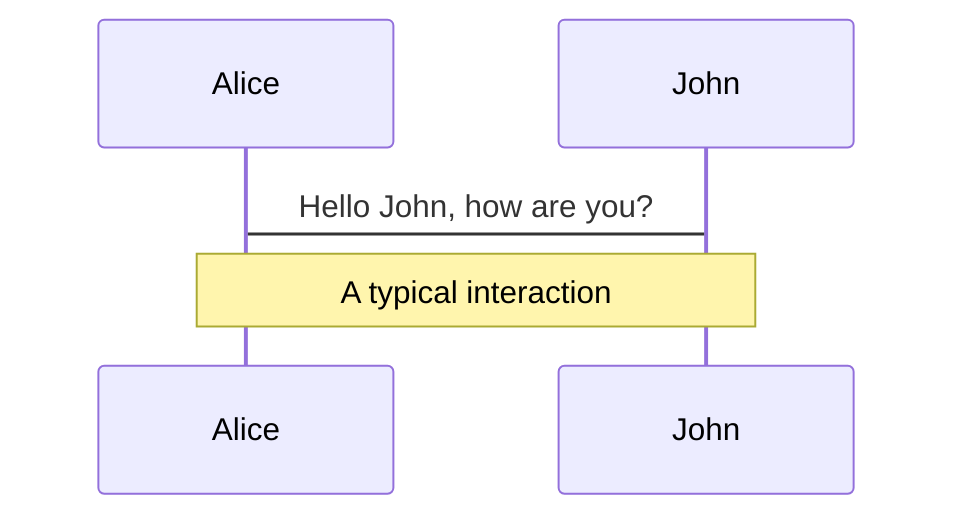
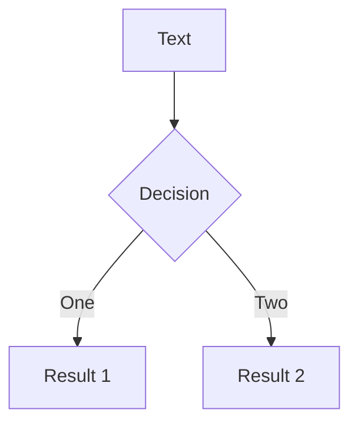
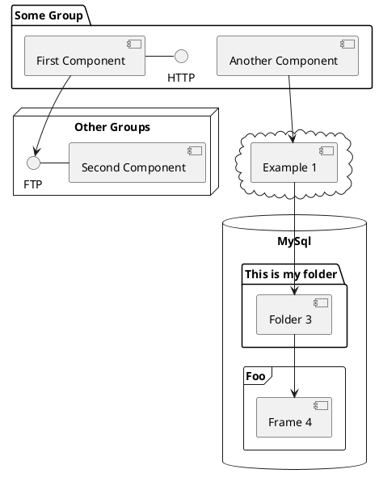

---
# try also 'default' to start simple
theme: default
# random image from a curated Unsplash collection by Anthony
# like them? see https://unsplash.com/collections/94734566/slidev
# apply any windi css classes to the current slide
class: "text-center"
# https://sli.dev/custom/highlighters.html
highlighter: shiki
# show line numbers in code blocks
lineNumbers: false
# some information about the slides, markdown enabled
info: |
  ## Slidev Starter Template
  Presentation slides for developers.

  Learn more at [Sli.dev](https://sli.dev)
# persist drawings in exports and build
drawings:
  persist: false

layout: "center"
counts: 0
download: true
---


# Vue.js

<i>One framework to rule them all</i>

<div class="abs-br m-6 flex gap-2">
  <button @click="$slidev.nav.openInEditor()" title="Open in Editor" class="text-xl icon-btn opacity-50 !border-none !hover:text-white">
    <carbon:edit />
  </button>
  <a href="https://github.com/slidevjs/slidev" target="_blank" alt="GitHub"
    class="text-xl icon-btn opacity-50 !border-none !hover:text-white">
    <carbon-logo-github />
  </a>
</div>

<!--
The last comment block of each slide will be treated as slide notes. It will be visible and editable in Presenter Mode along with the slide. [Read more in the docs](https://sli.dev/guide/syntax.html#notes)
-->

---

# Pourquoi Vue.js ?

<div v-click></div>
<Frameworks />

---
layout: two-cols
---
# Pourquoi un framework?

<v-click>

### <i>Avant</i>

<i>HTML</i>

```html
<input class="name" value="" />
<p class="result"></p>
```

<i>Javascript</i>

```js {all|1|4,7|2,5-6|all}
const input = document.querySelector(".name");
const result = document.querySelector(".result");

input.addEventListener("change", (event) => {
  const newValue = event.target.value;
  result.textContent += newValue;
});
```

</v-click>

::right::

<v-after>

# <br>

### <i>Maintenant</i>

<i>HTML</i>
<br>

```html
<input class="name" v-model="result" />
<p>{{ result }}</p>
```

<i>Javascript</i>

```js {all|all|3|all}
data() {
  return {
    result: '',
  }
}
```

<arrow v-click="9" x1="550" y1="300" x2="650" y2="215" color="#41b883" width="3" arrowSize="0,3" />

</v-after>

<style>
pre {
  @apply mr-10;
}
</style>

---
layout: two-cols
---

# La philosophie Vue.js

- DOM virtuel de composants
- Réutilisation simplifiée de logique à travers une App
- Manipulation plus simple des interfaces (ou des "Vues")

```html {all|4-6,14-16}
<!-- DOM html -->
<html>
  <body>
    <header>
      Navbar
    </header>
    <div>
      <form id="formulaireInscription">
        <label for="name">Name</label>
        <input name="name" />
        ...
      </form>
    </div>
    <footer>
      Contact
    </footer>
  </body>
</html>
```

::right::

<div class="last-space"></div>

```js {all|3,5}
// DOM Vue
<App>
  <Layout theme="dark">
    <FormulaireInscription />
  </Layout>
</App>
```

<style>
  pre {
    margin-right: 5px;
  }
  .slidev-layout {
    font-size: 0.9rem;
  }

  .last-space {
    margin-top: 133.5px;
    margin-left: 5px;
  }
  li {
    list-style: circle;
  }
</style>

---
layout: two-cols
---
# Les composants

_Pour un code réutilisable_

```html {all|2-5|7-17|19-21|all}
<!-- MonComposant.vue -->
<template>
  <input class="myInput" v-model="result" />
  <span> {{ result }} </span>
</template>

<script>
  import { defineComponent } from "vue";

  export default defineComponent({
    data() {
      return {
        result: "",
      };
    },
  });
</script>

<style>
  .myInput { background-color: gray; }
</style>
```

::right::
<v-click at="5">

# <br>

_Exemple_

<MyComponent />

<br>
<br>
<br>

</v-click>

<v-click at="6">

## Et pour l'utiliser?

```js
<MonComposant />

// ou

<mon-composant />
```

##### On peut réutiliser ce composant ou on veut sans avoir besoin de réecrire sa logique et sa structure à chaque fois.

</v-click>

<style>
pre {
  @apply mr-5;
}

h2 {
  @apply text-[#41b883]
}
</style>

---

# A vous de jouer !

##

En utilisant le template d'application Vue fourni, créez le composant de la slide précédente. <br>

Ce composant contient une donnée `result` qui est liée à un `input` qui prend votre entrée et l'affiche dans un `span`.

###

<br>

<div class="w-full flex mt-10">
  <uim-microscope class="text-10xl text-[#8be9ff] m-auto"/>
</div>
---
layout: two-cols
---

# Directives

## _v-if_
<br>

```html {all|3,10|all}
<template>
  <input v-model="name">
  <span v-if="name === 'bob'"> {{ name }} </span>
</template>
<script>
import { defineComponent } from 'vue';
export default defineComponent({
  data: () => {
    return {
      name: 'toto',
    }
  },
})
</script>
```

::right::
<ReactiveInputExample vif />

---
layout: two-cols
---

# v-for
##

```html {all|3-5,13|all}
<template>
  <ul>
    <li v-for="legume in legumes" :key="legume"> 
      {{ legume }} 
    </li>
  </ul>
</template>
<script>
import { defineComponent } from 'vue';
export default defineComponent({
  data: () => {
    return {
      legumes: ['tomate', 'oignon', 'carotte']
    }
  }
});
</script>
```
::right::

<ReactiveInputExample vfor />

---
layout: two-cols
---

# v-on
##

```html
<template>
  <button v-on:click="counter++">Incrémenter</button>
  <span> {{ counter }} </span>
</template>
```

Syntaxe simplifiée (à utiliser):

```html
<template>
  <button @click="counter++">Incrémenter</button>
  <span> {{ counter }} </span>
</template>
```

Script : 
```js
export default defineComponent({
  data: () => {
    return {
      counter: 0,
    }
  }
});
```

::right::

<ReactiveInputExample von />
---
layout: default
---

# A vous !

##

Créez un composant qui contient : une liste de noms, un input et un bouton.

1 - Au clic sur le bouton, ajouter le contenu de l'input dans la liste. <br>
2 - Ajouter une condition sur la liste, pour ne l'afficher uniquement que lorsqu'elle contient 3 éléments.

<div class="w-full flex mt-10">
  <uil-brackets-curly class="text-10xl text-[#8be9ff] m-auto"/>
</div>


---
layout: default
---
# Les options d'un composant
##

- Options de données :
  - data 
  - computed
  - props

- Options de mutations de données :
  - methods 

- Options de cycle de vie :
  - created
  - mounted
  - setup

_Il y en a d'autres, mais pour l'instant, on va se limiter à ceux là_
---
layout: default
---
# Computed

---

# Communiquer avec un composant

##

Deux types de communication :

- Parent <uil-arrow-right /> Enfant
- Enfant <uil-arrow-right /> Parent

<div class="flex justify-center">
  
</div>


<style>
li {
  list-style: circle;
}
</style>

---

# Communication Parent-Enfant

## Props

Le composant :

```html
<template>
  <span>{{ numero }}</span>
</template>

<script>
import { defineComponent } from "vue";

export default defineComponent({
  props: {
    numero: Number,
  },
});
</script>
```

L'appel depuis le parent :

```js
<MonComposant numero="9"/>
```
---
layout: two-cols
---
## Communication Enfant-Parent

Events: 

Dans l'enfant :

```html
<template>
  <button @click="sendDataToParent(data)">
    Alert parent
  </button>
</template>
<script>
import { defineComponent } from 'vue';

export default defineComponent({
  emits: ['update-data'],
  methods: {
    sendDataToParent(data) {
      this.$emit('update-data', data);
    }
  }
});
</script>
```

::right::

<div class="last-space"></div>

Dans le parent : 

```html
<template>
  <composant-enfant @updateData="handleChildData"/>
</template>
<script>
import { defineComponent } from 'vue';

export default defineComponent({
  methods: {
    handleChildData(data) {
      console.log(data);
    }
  }
})
</script>
```

<style>
  pre {
    margin-right: 5px;
  }

  .last-space {
    margin-top: 92px;
    margin-left: 5px;
  }
</style>

---
preload: false
---
# Animations

Animations are powered by [@vueuse/motion](https://motion.vueuse.org/).

```html
<div v-motion :initial="{ x: -80 }" :enter="{ x: 0 }">Slidev</div>
```

<div class="w-60 relative mt-6">
  <div class="relative w-40 h-40">
    
    
    
  </div>

  <div
    class="text-5xl absolute top-14 left-40 text-[#2B90B6] -z-1"
    v-motion
    :initial="{ x: -80, opacity: 0}"
    :enter="{ x: 0, opacity: 1, transition: { delay: 2000, duration: 1000 } }">
    Slidev
  </div>
</div>

<!-- vue script setup scripts can be directly used in markdown, and will only affects current page -->
<script setup lang="ts">
const final = {
  x: 0,
  y: 0,
  rotate: 0,
  scale: 1,
  transition: {
    type: 'spring',
    damping: 10,
    stiffness: 20,
    mass: 2
  }
}
</script>

<div
  v-motion
  :initial="{ x:35, y: 40, opacity: 0}"
  :enter="{ y: 0, opacity: 1, transition: { delay: 3500 } }">

[Learn More](https://sli.dev/guide/animations.html#motion)

</div>

---
layout: center
---
# LaTeX

## Latex test

### Latext v3

LaTeX is supported out-of-box powered by [KaTeX](https://katex.org/).

<br>

Inline $\sqrt{3x-1}+(1+x)^2$

Block

$$
\begin{array}{c}

\nabla \times \vec{\mathbf{B}} -\, \frac1c\, \frac{\partial\vec{\mathbf{E}}}{\partial t} &
= \frac{4\pi}{c}\vec{\mathbf{j}}    \nabla \cdot \vec{\mathbf{E}} & = 4 \pi \rho \\

\nabla \times \vec{\mathbf{E}}\, +\, \frac1c\, \frac{\partial\vec{\mathbf{B}}}{\partial t} & = \vec{\mathbf{0}} \\

\nabla \cdot \vec{\mathbf{B}} & = 0

\end{array}
$$

<br>

[Learn more](https://sli.dev/guide/syntax#latex)

---

# Diagrams

You can create diagrams / graphs from textual descriptions, directly in your Markdown.

<div class="grid grid-cols-3 gap-10 pt-4 -mb-6">







</div>

[Learn More](https://sli.dev/guide/syntax.html#diagrams)

---

layout: center
class: text-center

---

# Learn More

[Documentations](https://sli.dev) · [GitHub](https://github.com/slidevjs/slidev) · [Showcases](https://sli.dev/showcases.html)
